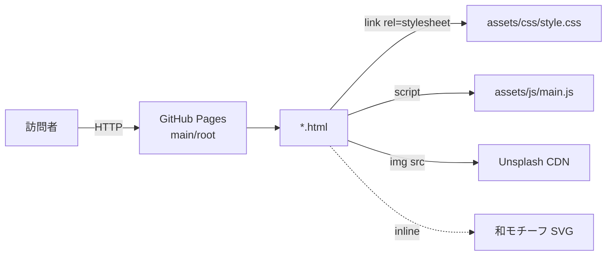
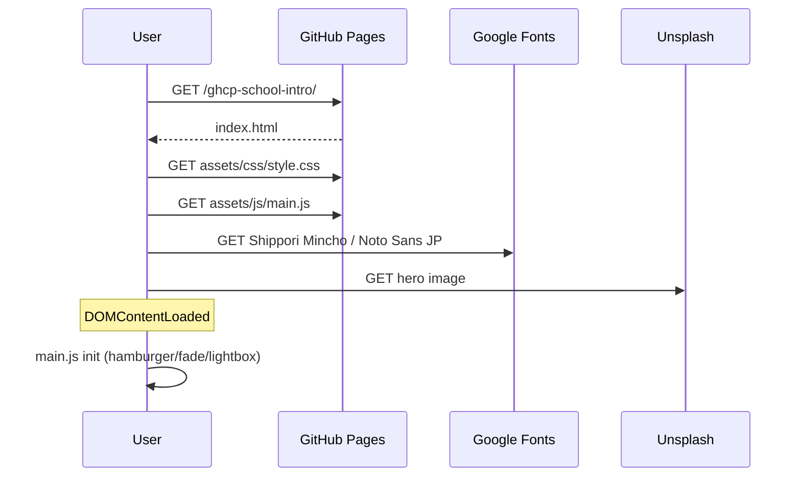

# Design: 神山まるごと高専 紹介サイト ミニマル和風リニューアル

## 実行戦略
Confidence Score **92%**（High）— PoC を挟まず、設計に従って全面実装を進める。

## アーキテクチャ

### 構成概要
静的 HTML + CSS + バニラ JS の 3 層構成。ビルドツールなし。
GitHub Pages（main/root ブランチデプロイ）で配信。

```
/ (repo root)
├── .nojekyll                 # Jekyll 処理回避（新規）
├── index.html                # トップ
├── about.html                # 理念・設立背景
├── curriculum.html           # 3軸 + タイムライン
├── campus-life.html          # 寮・行事・ギャラリー
├── access.html               # 地図・交通手段
├── README.md                 # Pages 手順・非公式注記（更新）
└── assets/
    ├── css/style.css         # 全面刷新（デザイントークン + コンポーネント）
    ├── js/main.js            # 流用（微調整のみ）
    └── images/.gitkeep       # 維持
```

### コンポーネント階層
- **Layout**: `header.site-header` / `main` / `footer.site-footer`
- **Navigation**: `nav.site-nav` + `.hamburger`（既存 JS 利用）
- **Hero**: `section.hero`（index 専用、大余白 + 明朝大見出し）
- **Section Divider**: `.divider-kikko` / `.divider-line`（SVG インライン）
- **Card**: `.card`（罫線ベース、角丸控えめ）
- **Pillar Card**: `.pillar`（縦罫見出し、index 3本柱）
- **Timeline**: `.timeline-ring`（年輪モチーフ縦軸、curriculum）
- **Lantern Card**: `.card-lantern`（行燈枠、access）
- **Lightbox**: `.lightbox`（既存 JS）

## データフロー



ランタイム動作:
1. ページロード → CSS 変数展開 → 明朝/ゴシックフォントを Google Fonts から取得。
2. `main.js` が DOMContentLoaded でハンバーガー・フェードイン IntersectionObserver・lightbox を初期化。
3. 訪問者操作（メニュー開閉 / ギャラリークリック）は JS 側で処理。

## インターフェース

### CSS カスタムプロパティ（デザイントークン）
```css
:root {
  /* color */
  --c-deep: #2d4a2b;
  --c-leaf: #6b8e4e;
  --c-sage: #a8c090;
  --c-paper: #f5ecd7;
  --c-cream: #faf6ee;
  --c-wood: #8b6f47;
  --c-bark: #5c4a30;
  --c-vermilion: #b34d3a; /* 朱アクセント（hover/注記のみ） */
  --c-ink: #2a2a2a;
  --c-ink-sub: #5c5a55;

  /* typography */
  --f-mincho: "Shippori Mincho", "Noto Serif JP", serif;
  --f-sans: "Noto Sans JP", system-ui, sans-serif;
  --fs-hero: clamp(2.4rem, 5vw, 4rem);
  --fs-h2: clamp(1.8rem, 3vw, 2.6rem);
  --fs-h3: 1.25rem;
  --lh-heading: 1.5;
  --lh-body: 1.9;
  --ls-heading: 0.08em; /* 和組の字間 */

  /* spacing（和の余白スケール） */
  --sp-1: 0.5rem;
  --sp-2: 1rem;
  --sp-3: 1.5rem;
  --sp-4: 2.5rem;
  --sp-5: 4rem;
  --sp-6: 6rem;

  /* layout */
  --container: 1120px;
  --radius-sm: 2px;
  --radius-md: 4px;
}
```

### 共通コンポーネント仕様

| コンポーネント | 役割 | 主要クラス | 特徴 |
|---|---|---|---|
| Header | ロゴ + ナビ | `.site-header` `.brand` `.brand__leaf` | 葉SVG・明朝ロゴ・余白大 |
| Section Divider | 区切り | `.divider-kikko` `.divider-line` | インライン SVG + `aria-hidden` |
| Pillar Card | 3本柱 | `.pillar` `.pillar__rule` | 左縦罫 + 明朝見出し |
| Timeline | 年輪縦軸 | `.timeline-ring` `.timeline-ring__node` | 同心円 SVG ノード |
| Lantern Card | 行燈 | `.card-lantern` | 上下細線 + 中央余白 |
| Button | CTA | `.btn` `.btn--primary` | 深緑塗り、hover で朱下線は不使用 |
| Link hover | インライン | `a:hover` | 朱色下線のみ |

### SVG モチーフ仕様
- **葉 SVG** (`.brand__leaf`): 24x24、深緑単色、ヘッダーロゴ左。
- **亀甲紋ディバイダー**: 幅 100%、高さ 24px、1本線＋3つの六角形中心装飾、`stroke: var(--c-wood); opacity: 0.35;`
- **年輪ノード**: 40x40、同心円 3 重、`fill: none; stroke: var(--c-leaf);`

全 SVG は HTML にインラインで記述し、`role="presentation"` / `aria-hidden="true"` を付与。

## データモデル
動的データなし。全コンテンツは HTML にハードコード。
Unsplash 画像 URL は既存のものを維持。

## エラーハンドリング

| ケース | 想定 | 対応 |
|---|---|---|
| 画像 404（Unsplash URL 変更） | 稀 | `loading="lazy"` + alt 文言で情報劣化を最小化。lightbox は存在確認して開く。 |
| フォント読み込み失敗 | 稀 | フォールバック（Noto Serif JP / system-ui）を CSS で指定済み。 |
| JS 無効環境 | 発生しうる | ハンバーガー非表示時でもナビはフォールバックリストとして可読。lightbox 無効時も画像は直接表示可。 |
| Pages サブパス誤解決 | 設定ミス時 | 全パスを相対（`assets/...` / `about.html`）で記述し、絶対パス `/assets` を使わない。 |

## テスト戦略（手動 + ツール）

### 単体相当（コンポーネント目視）
- 各ページでヘッダー・フッター・ディバイダー・カードが仕様通りに表示されるか目視。

### 統合（ページ遷移）
- 5 ページ全ナビゲーションリンクで相互遷移。戻るボタンで履歴正常。

### E2E（公開後）
- `https://zyannkenn.github.io/ghcp-school-intro/` で 5 ページ閲覧・アセット 404 なし。

### 非機能
- Lighthouse Accessibility ≥ 90
- モバイル 375px / タブレット 768px / デスクトップ 1440px でレイアウト崩れなし
- DevTools Network で 404 ゼロ

## シーケンス図（ページロード）



## 決定事項（Decision Records）

### Decision - Design Phase
**Decision**: 既存 CSS を全面差し替え（ゼロ再構築は不採用）  
**Context**: 既存は森系トーンだが和風要素不足。構造は活用可能。  
**Options**: (A) ゼロ再構築 / (B) CSS のみ差し替え＋HTML微整理 / (C) 部分的パッチ  
**Rationale**: (B) は実装コスト最小で要件を満たす。(A) は過剰、(C) はトーン統一が困難。  
**Impact**: `assets/css/style.css` が唯一の大規模変更対象となり、HTML 変更は最小限に抑えられる。  
**Review**: 公開後ユーザーフィードバック受領時。

### Decision - SVG 運用
**Decision**: 和モチーフはインライン SVG + CSS のみで実装  
**Context**: 画像アセットの増加を避けつつ和風意匠を表現する必要。  
**Options**: (A) 画像追加 / (B) インライン SVG / (C) アイコンフォント  
**Rationale**: (B) はリクエスト数を増やさず、色も CSS で可変。  
**Impact**: HTML がやや冗長化するが、保守性・パフォーマンスは良好。  
**Review**: 装飾要望増加時に外部 SVG 化を検討。

### Decision - デプロイ方式
**Decision**: main / root ブランチデプロイ（Actions 不採用）  
**Context**: ビルドツール未使用の静的サイト。  
**Options**: (A) main/root / (B) gh-pages ブランチ / (C) Actions  
**Rationale**: (A) は設定1箇所で完結し最小摩擦。  
**Impact**: `.nojekyll` 必須。相対パス運用を徹底。  
**Review**: ビルド工程導入時に再評価。
